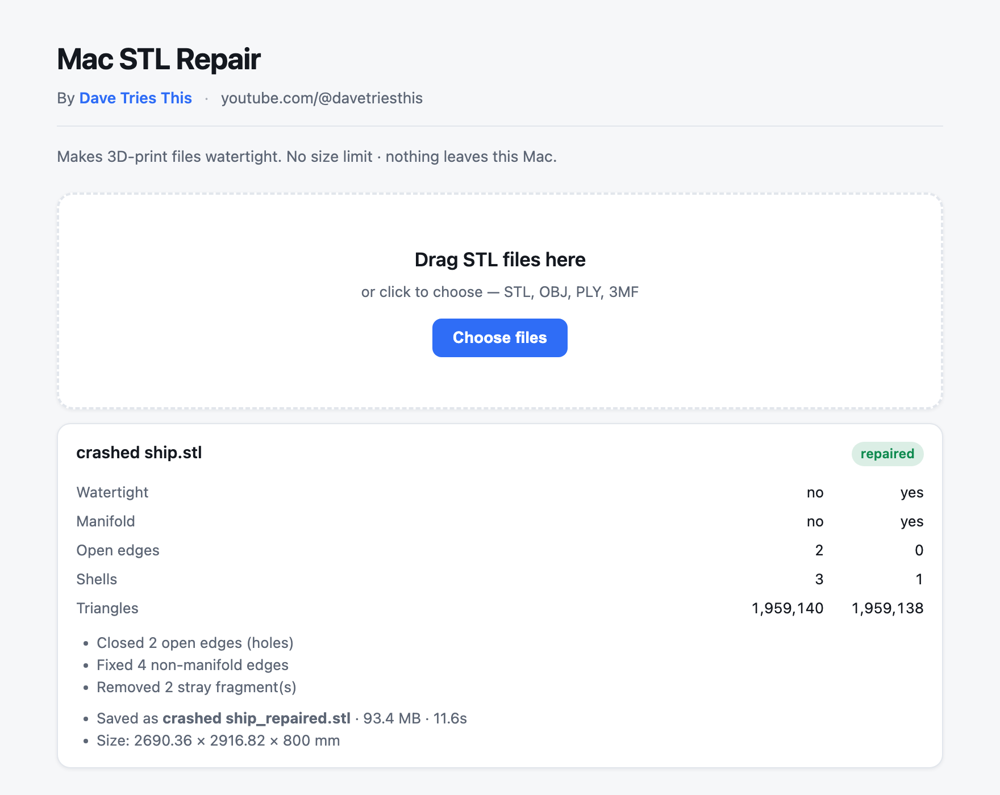

# Mac STL Repair

A free Mac app that makes broken STL files printable — holes closed,
non-manifold edges resolved, flipped normals corrected, stray fragments
removed. **No file size limit**, and nothing ever leaves the machine.

By [Dave Tries This](https://youtube.com/@davetriesthis) ·
distributed via Payhip · short link <https://rebrand.ly/stlrepair>

This repo holds the **source**. Built releases are distributed as a signed,
notarised `.dmg`; the build output is deliberately not committed.



## Why it exists

Mesh repair is the weak spot in a Mac 3D-printing setup. The desktop tools
everyone recommends are Windows-only, which leaves Mac users on browser-based
repair services that cap uploads — commonly around 50 MB — and require handing
your model to someone else's server. This runs natively and locally instead.
A 93 MB, 1.96-million-triangle model repairs in about 11 seconds.

## Repo contents

| file | what it is |
|---|---|
| `stlrepair.py` | repair engine + standalone command-line tool |
| `stlrepair_app.py` | local web server + drag-and-drop browser UI |
| `build.sh` | venv → dependencies → PyInstaller `.app` |
| `sign_and_notarize.sh` | signs inside-out, notarises, staples |
| `make_dmg.sh` | builds (and optionally notarises) the distributable `.dmg` |
| `entitlements.plist` | hardened-runtime entitlements CPython needs |
| `CONTINUE-HERE.md` | full step-by-step build/sign/ship runbook |
| `BUILD.md` | build notes and troubleshooting |
| `Product Description.md` | marketing copy for Payhip / video descriptions |
| `Read Me.txt` | the file shipped inside the `.dmg` |

## Quick start

```bash
bash build.sh                      # -> dist/STL Repair.app
bash sign_and_notarize.sh PROFILE  # sign + notarise + staple
bash make_dmg.sh PROFILE           # -> STL Repair.dmg
```

Run without bundling:

```bash
python3 stlrepair_app.py           # browser UI
python3 stlrepair.py --help        # command line
```

See `CONTINUE-HERE.md` for the full runbook including certificate setup.

## Three traps, all of which fail silently

1. **`trimesh.Trimesh.split()` quietly fills holes as a side effect.** It turned
   a 10-face open cube into a 12-face "watertight" one by chording across a
   corner, losing 16.7% of the volume — before the real repair even ran.
   `split_components()` walks face adjacency and rebuilds submeshes by hand
   instead. Do not replace it with `mesh.split()`.
2. **`pymeshfix` 0.18 returns `.points` / `.faces`**, not the `.v` / `.f` in
   older docs. The old names still exist but are `None`.
3. **Never build inside iCloud Drive.** iCloud adds extended attributes and
   `codesign` fails with *"resource fork, Finder information, or similar
   detritus not allowed"*. Build under `~/`. Also keep conda's Python away from
   PyInstaller — `build.sh` skips any conda prefix automatically.

## Integrity guards — keep these

Closing a hole invents geometry, so the report says how much it invented:
a **volume change** warning when the input was already a closed solid, and a
**triangles added** note when it wasn't. They are what stop a silently-wrong
repair from passing as a good one.

## Caveats

- **Apple Silicon only.** Intel Macs must build from source on their own machine.
- Patched regions are reconstructed, not recovered — a large hole is closed
  plausibly, not necessarily the way the original surface ran.

## Credits

The repair guarantee comes from **MeshFix**, by Marco Attene at IMATI-GE / CNR
(<https://github.com/MarcoAttene/MeshFix-V2.1>). If you use it in research,
cite: M. Attene, *A lightweight approach to repairing digitized polygon
meshes*, The Visual Computer, 2010.

The Python engine reaches MeshFix through
[pymeshfix](https://github.com/pyvista/pymeshfix) and uses
[trimesh](https://github.com/mikedh/trimesh) for mesh handling. The Swift
engine vendors MeshFix directly (`swift/Sources/CMeshFix/`) and implements the
mesh handling itself.

## Licence

**GPLv3.** See [LICENSE](LICENSE).

This is not a free choice — it follows from MeshFix. MeshFix is dual-licensed:
GPLv3, or a separate commercial contract from IMATI-GE / CNR. Building on the
GPLv3 side means this app is GPLv3 too, which is why the source lives here in
public. Anyone distributing a modified build has to do the same.

Note also that MeshFix's own terms state it "cannot be used for commercial
purposes without a proper licensing contract." That is why this app is free.
